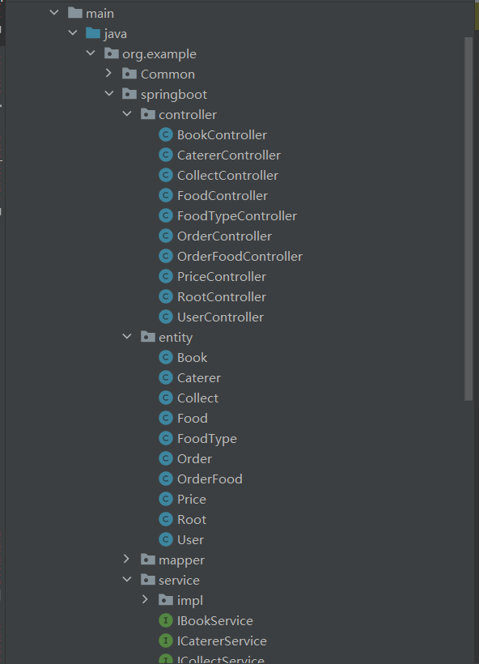

## PJ 工程进度
### 项目结构搭建
已经完成基于框架的所有接口类、服务类、实体类的创建

### 查询任务
#### 基础
划去部分已经完成
同时大部分表结构映射的实体查询都可以基于框架快速搭建
部分查询需要新建实体类来进行映射 尚未完成
 * ~~a. 查询某家商户的菜品简略信息列表；~~
 * ~~b. 查询某菜品的详细信息；~~
 * c. 查询消息列表；
 * ~~d. 查询某个用户的订单历史；~~
 * ~~e. 查询所有商户的简略信息。~~
 * f. 查询某个商户所有菜品的收藏量；
 * g. 查询各个菜品通过排队点餐和在线点餐的销量。
#### 进阶
* a. 菜品数据分析：某个商户所有菜品的评分、销量以及购买该菜品次数最多的
人。
* b. 某用户收藏的各个菜品在一段时间（近一周，近一月，近一年）内不同点餐
方式的销量可进行筛选。界面上不要求用可视化图表来显示菜品销量对应关系。
但需要强化相关查询能力，结果要能便于直接显示到界面（但不需要去实现这个
界面；可自行规定数据格式，不需要针对特定的 UI 组件去实现数据格式）。
* c. 一段时间内某个商户的忠实粉丝在该商户的消费分布。（忠实粉丝：在该商户
消费次数超过某个阈值的用户；消费分布：各个菜品购买次数）
* d. 用户活跃度分析：分析用户的活跃度模式，包括每周、每月点餐频率的变化
趋势，以及用户在不同时间段的活跃程度。
* e. 用户群体特征分析：根据用户的角色、年龄和性别等信息，对用户群体进行
特征分析。比如根据年龄段/角色/性别对用户进行区分得出点餐习惯（在各个商户
的用餐次数/某一菜品的购买数量/...）和评价习惯（评价的数量/评分给出的分数）。

### 接口
* 目前统一使用get请求 便于测试
* 后续将修改接口设置

